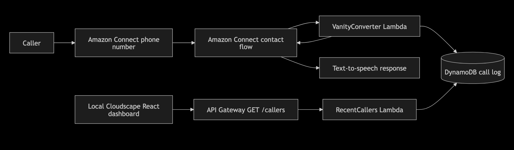
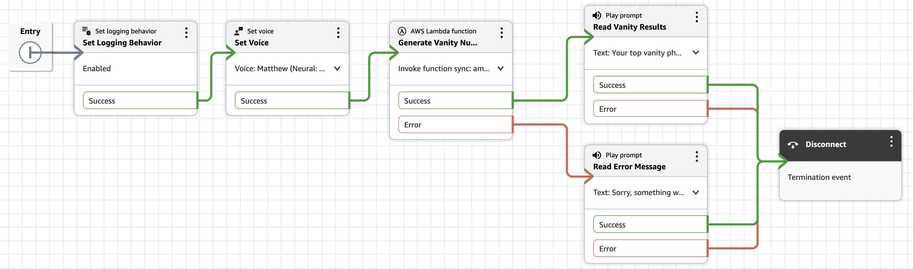
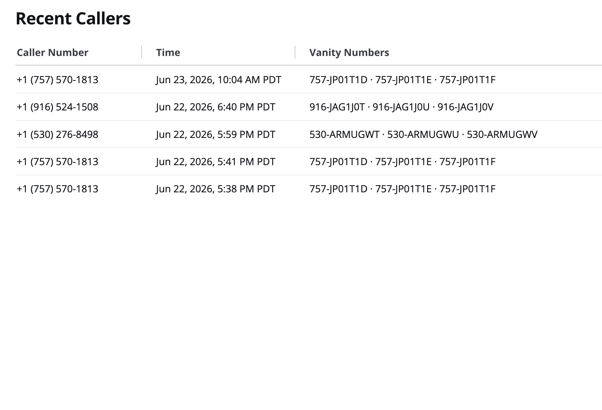

# Amazon Connect Vanity Number Generator

A take-home assignment for TTEC Digital demonstrating an Amazon Connect contact flow that converts caller phone numbers to vanity numbers, stores and ranks results in DynamoDB, announces the top matches through text-to-speech, and exposes recent call activity through a Cloudscape React dashboard.

## Quick Review

| Item | Value |
|---|---|
| **Phone number** | +1 (888) 213-1948 |
| **Live dashboard** | http://vanity-web-141262468065.s3-website-us-west-2.amazonaws.com |

Call the number from any phone to hear 3 vanity options. Your call appears in the dashboard within seconds.

## Assignment Coverage

| | Requirement | Where |
|---|---|---|
| ✅ | Vanity number Lambda — converts caller number, scores candidates, stores top 5 in DynamoDB, returns top 3 | `src/vanity-converter/` |
| ✅ | Amazon Connect contact flow — speaks top 3 results via TTS | [Contact flow design](docs/ARCHITECTURE.md#contact-flow-design) |
| ✅ *bonus* | SAM + CDK deployment packages with full setup instructions | `infrastructure/template.yaml`, `infrastructure/cdk/` |
| ✅ *super bonus* | Cloudscape React dashboard — last 5 callers, publicly hosted | [Live dashboard](http://vanity-web-141262468065.s3-website-us-west-2.amazonaws.com) · `web/` |
| ✅ | Design decisions and rationale (12 documented) | [docs/DECISIONS.md](docs/DECISIONS.md) |
| ✅ | Struggles, shortcuts, and more-time items | [docs/ENGINEERING_NOTES.md](docs/ENGINEERING_NOTES.md) |
| ✅ *bonus* | Architecture diagram | [docs/ARCHITECTURE.md](docs/ARCHITECTURE.md) · [Screenshots](#screenshots) |

## Table of Contents

- [Assignment Coverage](#assignment-coverage)
- [Architecture](#architecture)
- [Prerequisites](#prerequisites)
- [Project Structure](#project-structure)
- [Local Development](#local-development)
- [Deployment](#deployment)
- [Testing the Solution](#testing-the-solution)
- [Screenshots](#screenshots)
- [Documentation](#documentation)

## Architecture

See [docs/ARCHITECTURE.md](docs/ARCHITECTURE.md) for the full architecture diagram and component breakdown.

## Prerequisites

- Node.js 20.x
- AWS CLI configured with appropriate credentials
- An Amazon Connect instance with a claimed phone number
- **CDK deployment (recommended):** AWS CDK CLI (`npm install -g aws-cdk`) — automates contact flow and phone number association
- **SAM deployment (original):** AWS SAM CLI (`brew install aws-sam-cli`) — deploys Lambda/DynamoDB/API; Connect wiring is manual

## Project Structure

```
.
├── src/
│   ├── vanity-converter/   # Lambda invoked by Connect
│   └── recent-callers/     # Lambda invoked by API Gateway for the web app
├── tests/unit/             # Jest unit tests (95 tests, 100% coverage)
├── web/                    # Cloudscape React app (Vite)
├── infrastructure/         # SAM template + CDK stack
├── docs/                   # Architecture, decisions, engineering notes
└── scripts/                # Local dev helpers (demo-vanity)
```

## Local Development

### 1. Install dependencies

```bash
npm install
```

### 2. Run unit tests

```bash
npm test
```

### 3. Type-check

```bash
npm run build
```

### 4. Build Lambda bundles

```bash
npm run build:sam
```

## Deployment

Two deployment paths are available. **CDK is recommended** — it deploys all infrastructure including the contact flow and phone number association automatically.

### CDK (recommended)

See [`infrastructure/cdk/README.md`](infrastructure/cdk/README.md) for full instructions. Summary:

```bash
cd infrastructure/cdk && npm install
export CONNECT_INSTANCE_ID=<your-instance-id>
export CONNECT_PHONE_NUMBER_ID=<your-phone-number-id>
npm run deploy
```

This deploys Lambda, DynamoDB, API Gateway, the contact flow, and associates the phone number — no manual Connect console steps required.

### SAM (original)

#### 1. Build Lambda bundles

```bash
npm run build:sam
```

#### 2. Deploy (guided first run)

```bash
sam deploy --template-file infrastructure/template.yaml --guided
```

Settings are saved to `samconfig.toml`. Subsequent deploys:

```bash
sam deploy --template-file infrastructure/template.yaml
```

#### 3. Wire up Amazon Connect

After deploying:

1. Note the `VanityConverterFunctionArn` from the SAM output.
2. In the Amazon Connect console, go to **AWS Lambda** and add the function ARN to the allowed list.
3. Build the contact flow manually in the Connect console. See [docs/ARCHITECTURE.md — Contact Flow Design](docs/ARCHITECTURE.md#contact-flow-design) for the exact flow structure.
4. Assign the contact flow to your claimed phone number.

#### 4. Deploy the web dashboard

The dashboard is hosted on S3 at:

> **http://vanity-web-141262468065.s3-website-us-west-2.amazonaws.com**

To redeploy after changes (requires `web/.env.local` with `VITE_API_URL` set):

```bash
npm run deploy:web
```

This rebuilds the Vite bundle and syncs `web/dist/` to S3.

**Local development alternative:** run `npm run dev:web` for a hot-reloading dev server at `http://localhost:5173`. Requires `web/.env.local`:

```bash
echo "VITE_API_URL=https://easj5hexd1.execute-api.us-west-2.amazonaws.com" > web/.env.local
npm run dev:web
```

## Testing the Solution

1. Call **+1 (888) 213-1948** from any phone.
2. Listen for 3 vanity number options.
3. Open the [live dashboard](http://vanity-web-141262468065.s3-website-us-west-2.amazonaws.com) — your number should appear as the most recent caller.

## Screenshots

**Architecture diagram:**



**Contact flow in Amazon Connect:**



**Recent Callers web dashboard:**



## Documentation

| Document | Contents |
|---|---|
| [docs/ARCHITECTURE.md](docs/ARCHITECTURE.md) | System diagram, component descriptions, Connect setup |
| [docs/DECISIONS.md](docs/DECISIONS.md) | Design decisions, tradeoffs, and rationale |
| [docs/ENGINEERING_NOTES.md](docs/ENGINEERING_NOTES.md) | Process notes, struggles, shortcuts, and what I'd do with more time |
